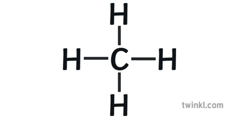

## T: Paliwa kopalne i przetwarzanie.

1. 

Paliwo - substancja zawierająca związki chemiczne lub ich mieszaniny zarówno organiczne jak i nieorganiczne pochodzenianaturalnego lub otrzymywane w sposób sztuczny, które się intensywnie utleniają (spalanie), wydzielając ciepo.
  
Paliwa ze względu na stan skupienia dzielą się na: stałe, ciekłe i gazowe.  
- Paliwa stałe: rewno, torf, węgiel brunatny, węgiel kamienny, œegiel antracytowy, grafit.
- Paliwa ciekłe: benzyna, olej napedowy, mazut, nafta, olej rzepakowy, eter, synttyczne *Synteza Fichera-Tropscha), olej opałowy, spirytus.
- Paliwa gazowe: gaz ziemny (w tym LNG i CNG), biogaz, gaz plynny LPG, eter dimetylowy DME, gaz generatorowy, gaz koksowniczy, gaz wielkopiecowy, acetylen, wodór.

2. Gaz ziemny  

Gaz ziemny pod względem chemicznym jest mieszaniną gazów. Zawartość składników jest zmienna i zależy od miejsca wydobycia, jednak głównym składnikiem stanowiącym ponad 90% gazu ziemnego jest zawsze metan (CH4)
   
Metoda wydobycia gazu ziemnego uzależniona jest od rodzaju odkrytego złoża. Gaz ziemny wydowyany jest ze złóż poprzez odwierty. Technologie wzbogacenia gazu ziemnego polega na eliminowaniu z jego składu cząstek stałych, pary wodnej, związków siarki i innych substancji niepożądanych.

Gaz zmieny, atym samym zawarty w nim metan nie mają zapachu. Dlatego do gazu ziemnego dodawane są substancje o intensywnym zapachu dzięki którym można wyczuć jego obecność w powietrzu.

3. Metan

Właściwości fizyczne:

- Stan skupienia - lotny
- Barwa -bezbarwny
- Zapach - bezwonny
- Gęstość - lżejszy od powietrza
- Rzpouszczalnośc w H2O - bardzo trudno rozpuszcza się w wodzie

Wzór sumaryczny - CH4  

##### Własciwości chemiczne metanu

##### Spalanie metanu
 - Czysty metan spala się spokojnnie niebieskawym płomieniem w miarę wydobywania się cząsteczek tego gazu  z probówki lub z przewodów, którymi jest doprowadzany do domów
 
- Przy zby małym dostepie tleny, gdy na jedna cząsteczke metanyu

4. Ropa naftowa  

Pochodzenie:
podobnie jek węgiel, ropa naftowa powstała z substancji ogranicznej nagromadzonej prze milionami lat z tą różnicą, że w przypadku ropy naftowej jest to substancja utworzona z ibomasy glonów i nizszych gatunków żyjących istot wodnych (Planktonu), jak i w pewnej mierze ze zwierząt o wyższym stopniu rozwoju.  

Ogranicznym materiałem wyjściowym w powstawaniu ropy naftowej byly w przeważającej mierze tłuszcze i białko oraz pozostałości bakterii biorących udział w procesie przemian materii organicznej. Wystepuje jako mieszanina węglowodorów, kwasów karboksylowych, fenoli, związków azotowych, żywic i związków metaloorganicznych.  

Ropa naftowa (olej skalny, czrne złoto) jest to ciekła kopalina, złożona z mieszaniny naturalnych węglowodorów gazowych ciekłych i stałych (bituminów), z niewielkimi domieszkami azotu, tlenu i siarki i zanieczysczeń.

##### Skład chemiczny ropy

##### 5. Rodzaje węgli kopalnych:

Szungit (najwyższa zawartości pierwiaska C wynosi do 99%)  
Antracyt (ponad 92% pierwiastka węgla)  
Węgiel kamienny (zawartość pierwiastka C wynosi 75-92%)  
Węgiel brunatny (zawartość pierwiastka C wynosi 63-78%)  
Torf (Zawartość pierwiastka C wynosi 55-65%)

