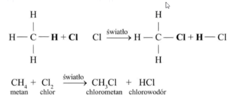
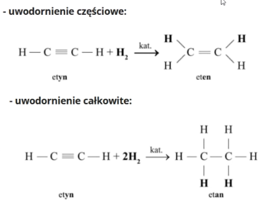

# T: Substytucja

Substytucja to wymiana między dwoma substratami cząsteczek prowadząca do powstania dwóch nowych.

Addycja - przyłączanie (Łączenie się dwóch substratów które tworzą jeden produkt)

